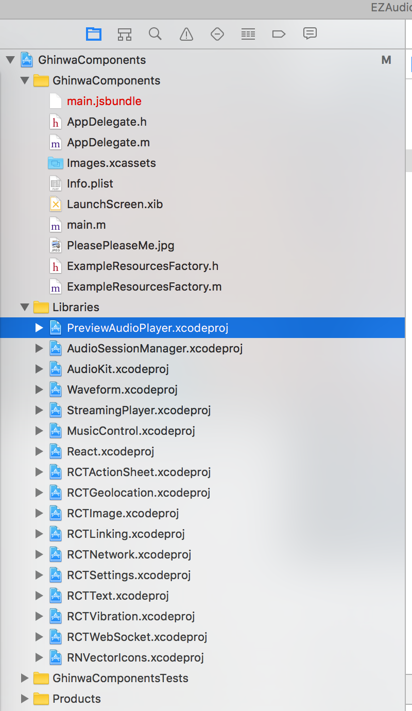
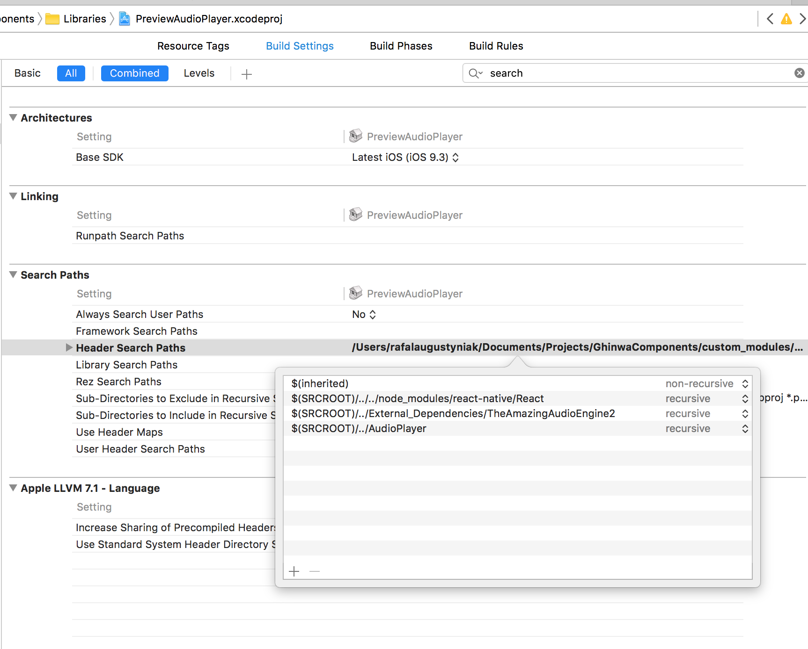
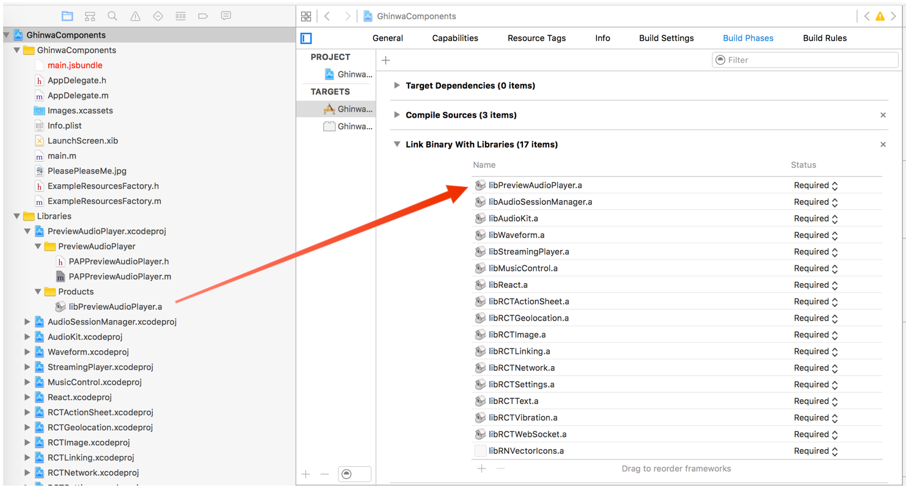

# ⚠️ Disclaimer
We are not supporting this module at this moment,
use by your own responsability.

# Installation

1. Integrate `AmazingAudioEngine2` library first.
2. Copy `ghinwa-rn-preview-audio-player` directory to your project.
3. Add `"ghinwa-rn-preview-audio-player": "file:./PATH_TO_PREVIEW_AUDIO_PLAYER_DIRECTORY"` to the `package.json` file.
4. Run `npm install` command.
5. Open `.xcodeproj` file of your main Xcode project. In the *Project Navigator*, select your main project and expand it.
6. Drag `PreviewAudioPlayer.xcodeproj` to your main project as it is presented on the screenshot below:

7. Add paths of `AudioPlayer` and `AmazingAudioEngine2` directories to the `Header Search Paths` setting (which can be found in `Build Settings`) of `PreviewAudioPlayer.xcodeproj` project.
 
8. Drag `libPreviewAudioPlayer.a` to the *Link Binary With Libraries* build phase of your main project as on the attached screenshot. 

9. Enjoy using `ghinwa-rn-preview-audio-player`!

